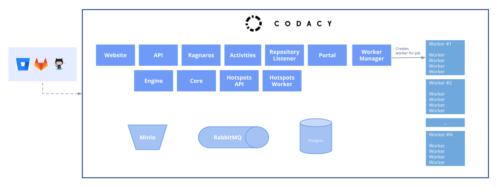

# Codacy Chart

With the Codacy chart it is possible to run all Codacy components and
its dependencies with a single command line.

[edit image](https://docs.google.com/drawings/d/1kLkRRQLxCK8NkliYls9mv882w4fomI3rVlZNeP8MLP4/edit)

Each service in Codacy has its chart published to our
[charts repository](https://charts.codacy.com/stable/api/charts).

This chart bundles all the components and their dependencies.
For the bundle, we make use of the
[requirements capability](https://helm.sh/docs/chart_best_practices/#requirements-files)
of Helm.

## Work in progress

This chart is still a **Work In Progress** and is not ready for general
usage. Our docker images are currently private and you will not be
able to run the chart by yourself. If you are interested in trying
out Codacy contact our support at support@codacy.com.

### Charts

Documentation on a per-chart basis is listed here.
Some of these repositories are private and accessible to Codacy engineers only.

[edit image](https://docs.google.com/drawings/d/1o7z3L8XnnNjHBOTWKHiIYUkBP3DDiogdUyxNdUfzyfY/edit)

-   [Minio](https://github.com/helm/charts/tree/master/stable/minio)
-   [RabbitMQ-HA](https://github.com/helm/charts/tree/master/stable/rabbitmq-ha)
-   [Postgres](https://github.com/helm/charts/tree/master/stable/postgresql)
-   [kube-fluentd-operator](https://github.com/codacy/kube-fluentd-operator)
-   Codacy/[Token Management](https://bitbucket.org/qamine/token-management/src/master/.helm/)
-   Codacy/[Website](https://bitbucket.org/qamine/codacy-website/src/master/.helm/)
-   Codacy/[API](https://bitbucket.org/qamine/codacy-website/src/master/.helm/)
-   Codacy/[Ragnaros](https://bitbucket.org/qamine/ragnaros/src/master/.helm/)
-   Codacy/[Activities](https://bitbucket.org/qamine/codacy-activities/src/master/.helm/)
-   Codacy/[Repository Listener](https://bitbucket.org/qamine/repository-listener/src/master/.helm/)
-   Codacy/[Portal](https://bitbucket.org/qamine/portal/src/master/.helm/)
-   Codacy/[Worker Manager](https://bitbucket.org/qamine/worker-manager/src/master/.helm/)
-   Codacy/[Engine](https://bitbucket.org/qamine/codacy-worker/src/master/.helm/)
-   Codacy/[Core](https://bitbucket.org/qamine/codacy-core/src/master/.helm/)
-   Codacy/[Hotspots API](https://bitbucket.org/qamine/hotspots-api/src/master/.helm/)
-   Codacy/[Hotspots Worker](https://bitbucket.org/qamine/hotspots-worker/src/master/.helm/)

## Configuration

The following table lists the configurable parameters of the Codacy chart and their default values.

Global parameters apply to all sub-charts and make it easier to configure resources across different components.

| Parameter                                   | Description                                                                                                                 | Default         |
| ------------------------------------------- | --------------------------------------------------------------------------------------------------------------------------- | --------------- |
| `global.codacy.url`                         | Hostname to your Codacy installation                                                                                        | `nil`           |
| `global.codacy.backendUrl`                  | Hostname to your Codacy installation                                                                                        | `nil`           |
| `global.play.cryptoSecret`                  | Secrets used internally for encryption. Generate one with `cat /dev/urandom | tr -dc 'a-zA-Z0-9' | fold -w 128 | head -n 1` | `nil`           |
| `global.filestore.contentsSecret`           | Secrets used internally for encryption. Generate one with `cat /dev/urandom | tr -dc 'a-zA-Z0-9' | fold -w 128 | head -n 1` | `nil`           |
| `global.filestore.uuidSecret`               | Secrets used internally for encryption. Generate one with `cat /dev/urandom | tr -dc 'a-zA-Z0-9' | fold -w 128 | head -n 1` | `nil`           |
| `global.cacheSecret`                        | Secrets used internally for encryption. Generate one with `cat /dev/urandom | tr -dc 'a-zA-Z0-9' | fold -w 128 | head -n 1` | `nil`           |
| `global.minio.create`                       | Create minio internally                                                                                                     | `nil`           |
| `global.rabbitmq.create`                    | Create rabbitmq internally                                                                                                  | `nil`           |
| `global.rabbitmq.rabbitmqUsername`          | Username for rabbitmq. If you are using the bundled version, change the `rabbitmq-ha.rabbitmqUsername` also.                | `nil`           |
| `global.rabbitmq.rabbitmqPassword`          | Password for rabbitmq. If you are using the bundled version, change the `rabbitmq-ha.rabbitmqPassword` also.                | `nil`           |
| `global.defaultdb.postgresqlUsername`       | Username of the Postgresql server                                                                                           | `codacy`        |
| `global.defaultdb.postgresqlDatabase`       | Database name of the Postgresql server                                                                                      | `default`       |
| `global.defaultdb.postgresqlPassword`       | Hostname of the Postgresql server                                                                                           | `nil`           |
| `global.defaultdb.host`                     | Hostname of the Postgresql server                                                                                           | `nil`           |
| `global.defaultdb.service.port`             | Port of the Postgresql server                                                                                               | `5432`          |
| `global.analysisdb.postgresqlUsername`      | Username of the Postgresql server                                                                                           | `codacy`        |
| `global.analysisdb.postgresqlDatabase`      | Database name of the Postgresql server                                                                                      | `analysis`      |
| `global.analysisdb.postgresqlPassword`      | Hostname of the Postgresql server                                                                                           | `nil`           |
| `global.analysisdb.host`                    | Hostname of the Postgresql server                                                                                           | `nil`           |
| `global.analysisdb.service.port`            | Port of the Postgresql server                                                                                               | `5432`          |
| `global.resultsdb.postgresqlUsername`       | Username of the Postgresql server                                                                                           | `codacy`        |
| `global.resultsdb.postgresqlDatabase`       | Database name of the Postgresql server                                                                                      | `results`       |
| `global.resultsdb.postgresqlPassword`       | Hostname of the Postgresql server                                                                                           | `nil`           |
| `global.resultsdb.host`                     | Hostname of the Postgresql server                                                                                           | `nil`           |
| `global.resultsdb.service.port`             | Port of the Postgresql server                                                                                               | `5432`          |
| `global.resultsdb201709.postgresqlUsername` | Username of the Postgresql server                                                                                           | `codacy`        |
| `global.resultsdb201709.postgresqlDatabase` | Database name of the Postgresql server                                                                                      | `results201709` |
| `global.resultsdb201709.postgresqlPassword` | Hostname of the Postgresql server                                                                                           | `nil`           |
| `global.resultsdb201709.host`               | Hostname of the Postgresql server                                                                                           | `nil`           |
| `global.resultsdb201709.service.port`       | Port of the Postgresql server                                                                                               | `5432`          |
| `global.metricsdb.postgresqlUsername`       | Username of the Postgresql server                                                                                           | `codacy`        |
| `global.metricsdb.postgresqlDatabase`       | Database name of the Postgresql server                                                                                      | `metrics`       |
| `global.metricsdb.postgresqlPassword`       | Hostname of the Postgresql server                                                                                           | `nil`           |
| `global.metricsdb.host`                     | Hostname of the Postgresql server                                                                                           | `nil`           |
| `global.metricsdb.service.port`             | Port of the Postgresql server                                                                                               | `5432`          |
| `global.filestoredb.postgresqlUsername`     | Username of the Postgresql server                                                                                           | `codacy`        |
| `global.filestoredb.postgresqlDatabase`     | Database name of the Postgresql server                                                                                      | `filestore`     |
| `global.filestoredb.postgresqlPassword`     | Hostname of the Postgresql server                                                                                           | `nil`           |
| `global.filestoredb.host`                   | Hostname of the Postgresql server                                                                                           | `nil`           |
| `global.filestoredb.service.port`           | Port of the Postgresql server                                                                                               | `5432`          |
| `global.jobsdb.postgresqlUsername`          | Username of the Postgresql server                                                                                           | `codacy`        |
| `global.jobsdb.postgresqlDatabase`          | Database name of the Postgresql server                                                                                      | `jobs`          |
| `global.jobsdb.postgresqlPassword`          | Hostname of the Postgresql server                                                                                           | `nil`           |
| `global.jobsdb.host`                        | Hostname of the Postgresql server                                                                                           | `nil`           |
| `global.jobsdb.service.port`                | Port of the Postgresql server                                                                                               | `5432`          |
| `global.githubEnterprise.enabled`           | Enable githubEnterprise                                                                                                     | `nil`           |
| `global.githubEnterprise.hostname`          | Hostname of githubEnterprise instance                                                                                       | `nil`           |
| `global.githubEnterprise.protocol`          | Protocol of githubEnterprise instance                                                                                       | `nil`           |
| `global.githubEnterprise.port`              | Port of githubEnterprise instance                                                                                           | `nil`           |
| `global.githubEnterprise.isPrivateMode`     | Status of private mode on githubEnterprise instance                                                                         | `nil`           |
| `global.githubEnterprise.disableSSL`        | Disable certificate validation on interaction with githubEnterprise instance                                                | `nil`           |
| `global.gitlabEnterprise.enabled`           | Enable gitlabEnterprise                                                                                                     | `nil`           |
| `global.gitlabEnterprise.hostname`          | Hostname of gitlabEnterprise instance                                                                                       | `nil`           |
| `global.gitlabEnterprise.protocol`          | Protocol of gitlabEnterprise instance                                                                                       | `nil`           |
| `global.gitlabEnterprise.port`              | Port of gitlabEnterprise instance                                                                                           | `nil`           |
| `global.bitbucketEnterprise.enabled`        | Enable bitbucketEnterprise                                                                                                  | `nil`           |
| `global.bitbucketEnterprise.hostname`       | Hostname of bitbucketEnterprise instance                                                                                    | `nil`           |
| `global.bitbucketEnterprise.protocol`       | Protocol of bitbucketEnterprise instance                                                                                    | `nil`           |
| `global.bitbucketEnterprise.port`           | Port of bitbucketEnterprise instance                                                                                        | `nil`           |

The following parameters are specific to each Codacy component.

| Parameter                                           | Description                                                                                         | Default                                      |
| --------------------------------------------------- | --------------------------------------------------------------------------------------------------- | -------------------------------------------- |
| `portal.replicaCount`                               | Number of replicas                                                                                  | `1`                                          |
| `portal.image.repository`                           | Image repository                                                                                    | from dependency                              |
| `portal.image.tag`                                  | Image tag                                                                                           | from dependency                              |
| `portal.service.type`                               | Portal service type                                                                                 | `ClusterIP`                                  |
| `portal.service.annotations`                        | Annotations to be added to the Portal service                                                       | `{}`                                         |
| `remote-provider-service.replicaCount`              | Number of replicas                                                                                  | `1`                                          |
| `remote-provider-service.image.repository`          | Image repository                                                                                    | from dependency                              |
| `remote-provider-service.image.tag`                 | Image tag                                                                                           | from dependency                              |
| `remote-provider-service.service.type`              | Remote Provider service type                                                                        | `ClusterIP`                                  |
| `remote-provider-service.service.annotations`       | Annotations to be added to the Remote Provider service                                              | `{}`                                         |
| `activities.replicaCount`                           | Number of replicas                                                                                  | `1`                                          |
| `activities.image.repository`                       | Image repository                                                                                    | from dependency                              |
| `activities.image.tag`                              | Image tag                                                                                           | from dependency                              |
| `activities.service.type`                           | Service type                                                                                        | `ClusterIP`                                  |
| `activities.service.annotations`                    | Annotations to be added to the service                                                              | `{}`                                         |
| `activities.activitiesdb.postgresqlUsername`        | Username of the Postgresql server                                                                   | `codacy`                                     |
| `activities.activitiesdb.postgresqlDatabase`        | Database name of the Postgresql server                                                              | `jobs`                                       |
| `activities.activitiesdb.postgresqlPassword`        | Hostname of the Postgresql server                                                                   | `nil`                                        |
| `activities.activitiesdb.host`                      | Hostname of the Postgresql server                                                                   | `nil`                                        |
| `activities.activitiesdb.service.port`              | Port of the Postgresql server                                                                       | `5432`                                       |
| `hotspots-api.replicaCount`                         | Number of replicas                                                                                  | `1`                                          |
| `hotspots-api.image.repository`                     | Image repository                                                                                    | from dependency                              |
| `hotspots-api.image.tag`                            | Image tag                                                                                           | from dependency                              |
| `hotspots-api.service.type`                         | Service type                                                                                        | `ClusterIP`                                  |
| `hotspots-api.service.annotations`                  | Annotations to be added to the service                                                              | `{}`                                         |
| `hotspots-api.hotspotsdb.postgresqlUsername`        | Username of the Postgresql server                                                                   | `codacy`                                     |
| `hotspots-api.hotspotsdb.postgresqlDatabase`        | Database name of the Postgresql server                                                              | `hotspots`                                   |
| `hotspots-api.hotspotsdb.postgresqlPassword`        | Hostname of the Postgresql server                                                                   | `nil`                                        |
| `hotspots-api.hotspotsdb.host`                      | Hostname of the Postgresql server                                                                   | `nil`                                        |
| `hotspots-api.hotspotsdb.service.port`              | Port of the Postgresql server                                                                       | `5432`                                       |
| `hotspots-worker.replicaCount`                      | Number of replicas                                                                                  | `1`                                          |
| `hotspots-worker.image.repository`                  | Image repository                                                                                    | from dependency                              |
| `hotspots-worker.image.tag`                         | Image tag                                                                                           | from dependency                              |
| `hotspots-worker.service.type`                      | Service type                                                                                        | `ClusterIP`                                  |
| `hotspots-worker.service.annotations`               | Annotations to be added to the service                                                              | `{}`                                         |
| `listener.replicaCount`                             | Number of replicas                                                                                  | `1`                                          |
| `listener.image.repository`                         | Image repository                                                                                    | from dependency                              |
| `listener.image.tag`                                | Image tag                                                                                           | from dependency                              |
| `listener.service.type`                             | Service type                                                                                        | `ClusterIP`                                  |
| `listener.service.annotations`                      | Annotations to be added to the service                                                              | `{}`                                         |
| `listener.persistence.claim.size`                   | Each pod mounts and NFS disk and claims this size.                                                  | `100Gi`                                      |
| `listener.nfsserverprovisioner.enabled`             | Creates an NFS server and a storage class to mount volumes in that server.                          | `true`                                       |
| `listener.nfsserverprovisioner.persistence.enabled` | Creates an NFS provisioner                                                                          | `true`                                       |
| `listener.nfsserverprovisioner.persistence.size`    | Size of the NFS server disk                                                                         | `120Gi`                                      |
| `listener.listenerdb.postgresqlUsername`            | Username of the Postgresql server                                                                   | `codacy`                                     |
| `listener.listenerdb.postgresqlDatabase`            | Database name of the Postgresql server                                                              | `listener`                                   |
| `listener.listenerdb.postgresqlPassword`            | Hostname of the Postgresql server                                                                   | `PLEASE_CHANGE_ME`                           |
| `listener.listenerdb.host`                          | Hostname of the Postgresql server                                                                   | `codacy-listenerdb.codacy.svc.cluster.local` |
| `listener.listenerdb.service.port`                  | Port of the Postgresql server                                                                       | `5432`                                       |
| `core.replicaCount`                                 | Number of replicas                                                                                  | `1`                                          |
| `core.image.repository`                             | Image repository                                                                                    | from dependency                              |
| `core.image.tag`                                    | Image tag                                                                                           | from dependency                              |
| `core.service.type`                                 | Service type                                                                                        | `ClusterIP`                                  |
| `engine.replicaCount`                               | Number of replicas                                                                                  | `1`                                          |
| `engine.image.repository`                           | Image repository                                                                                    | from dependency                              |
| `engine.image.tag`                                  | Image tag                                                                                           | from dependency                              |
| `engine.service.type`                               | Service type                                                                                        | `ClusterIP`                                  |
| `engine.service.annotations`                        | Annotations to be added to the service                                                              | `{}`                                         |
| `engine.metrics.serviceMonitor.enabled`             | Create the ServiceMonitor resource type to be read by prometheus operator.                          | `false`                                      |
| `codacy-api.image.repository`                       | Image repository                                                                                    | from dependency                              |
| `codacy-api.image.tag`                              | Image tag                                                                                           | from dependency                              |
| `codacy-api.service.type`                           | Service type                                                                                        | `ClusterIP`                                  |
| `codacy-api.config.license`                         | Codacy license for your installation                                                                | `nil`                                        |
| `codacy-api.service.annotations`                    | Annotations to be added to the service                                                              | `{}`                                         |
| `codacy-api.metrics.serviceMonitor.enabled`         | Create the ServiceMonitor resource type to be read by prometheus operator.                          | `false`                                      |
| `codacy-api.metrics.grafana_dashboards.enabled`     | Create the ConfigMap with the dashboard of this component. Can be imported through grafana sidecar. | `false`                                      |
| `worker-manager.config.workers.genericMax`          | TBD                                                                                                 | `100`                                        |
| `worker-manager.config.workers.dedicatedMax`        | TBD                                                                                                 | `100`                                        |
| `crow.replicaCount`                                 | Number of replicas                                                                                  | `1`                                          |
| `crow.image.repository`                             | Image repository                                                                                    | from dependency                              |
| `crow.image.tag`                                    | Image tag                                                                                           | from dependency                              |

The following parameters refer to components that are not internal to Codacy, but go as part of this bundle so that you can bootstrap Codacy faster.

| Parameter                        | Description                                                                                            | Default    |
| -------------------------------- | ------------------------------------------------------------------------------------------------------ | ---------- |
| `fluentdoperator.enable`         | Enable fluentd operator. It gathers logs from Codacy so that you can send it to our support if needed. | `false`    |
| `fluentdoperator.expirationDays` | Number of days to retain logs. More time uses more disk on minio.                                      | `14`       |
| `rabbitmq-ha.rabbitmqUsername`   | Username for the bundled RabbitMQ.                                                                     | `rabbitmq` |
| `rabbitmq-ha.rabbitmqPassword`   | Password for the bundled RabbitMQ.                                                                     | `rabbitmq` |

You can also configure values for the PostgreSQL database via the Postgresql [README.md](https://github.com/kubernetes/charts/blob/master/stable/postgresql/README.md)

For overriding variables see: [Customizing the chart](https://docs.helm.sh/using_helm/#customizing-the-chart-before-installing)
