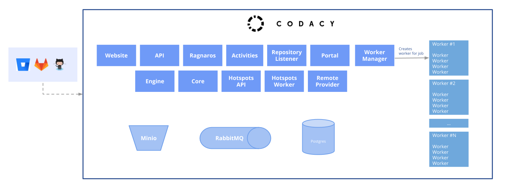

# Codacy Chart

This is the top level chart to run Codacy in self-hosted mode.
With this chart, it is possible to run all the components from Codacy,
plugging all the dependencies with a single command line, including Codacy,
PostgreSQL, RabbitMQ, Minio, Ingress etc...

## Work in progress

This chart is still a **Work In Progress** and is not ready for general usage. Our docker images are currently private,
you will not be able to run the chart by yourself. If you are
interested in trying out codacy contact our support at support@codacy.com.

## Goals

Core goals for this project:

1.  Easy to scale pods horizontally
2.  Easy to deploy, upgrade, maintain
3.  Wide support of cloud service providers
4.  Use external data stores, such as Minio (S3) or Amazon RDS (Postgres), whenever possible
5.  Users should be able to use their own certificates or use Let's Encrypt
6.  Users should be able to use a load balancer or an ingess

We will try to leverage standard Kubernetes features:

*   ConfigMaps for managing configuration. These will then get mapped or passed to Docker containers

## Helm Charts

[edit image](https://docs.google.com/drawings/d/1o7z3L8XnnNjHBOTWKHiIYUkBP3DDiogdUyxNdUfzyfY/edit)

Each service/component in Codacy has it's own chart published to `https://charts.codacy.com/stable`.

This chart bundles all the components and their dependencies. For the bundle we make use of the
[requirements capability](https://helm.sh/docs/chart_best_practices/#requirements-files)
of Helm.

### Charts

Documentation on a per-chart basis is listed here.
Some of these repositories are private and accessible to Codacy engineers only.

*   [Minio](https://github.com/helm/charts/tree/master/stable/minio)
*   [RabbitMQ-HA](https://github.com/helm/charts/tree/master/stable/rabbitmq-ha)
*   [Postgres](https://github.com/helm/charts/tree/master/stable/postgresql)
*   [kube-fluentd-operator](https://github.com/codacy/kube-fluentd-operator)
*   Codacy/[Token Management](https://bitbucket.org/qamine/token-management/src/master/.helm/)
*   Codacy/[Website](https://bitbucket.org/qamine/codacy-website/src/master/.helm/)
*   Codacy/[API](https://bitbucket.org/qamine/codacy-website/src/master/.helm/)
*   Codacy/[Ragnaros](https://bitbucket.org/qamine/ragnaros/src/master/.helm/)
*   Codacy/[Activities](https://bitbucket.org/qamine/codacy-activities/src/master/.helm/)
*   Codacy/[Repository Listener](https://bitbucket.org/qamine/repository-listener/src/master/.helm/)
*   Codacy/[Portal](https://bitbucket.org/qamine/portal/src/master/.helm/)
*   Codacy/[Worker Manager](https://bitbucket.org/qamine/worker-manager/src/master/.helm/)
*   Codacy/[Engine](https://bitbucket.org/qamine/codacy-worker/src/master/.helm/)
*   Codacy/[Core](https://bitbucket.org/qamine/codacy-core/src/master/.helm/)
*   Codacy/[Hotspots API](https://bitbucket.org/qamine/hotspots-api/src/master/.helm/)
*   Codacy/[Hotspots Worker](https://bitbucket.org/qamine/hotspots-worker/src/master/.helm/)

### Global settings

In order to prevent repetition, we make use of helm's [global values](https://helm.sh/docs/developing_charts/#global-values). In every
Codacy component chart or external chart we will try to make use of
these global settings as much as possible.
