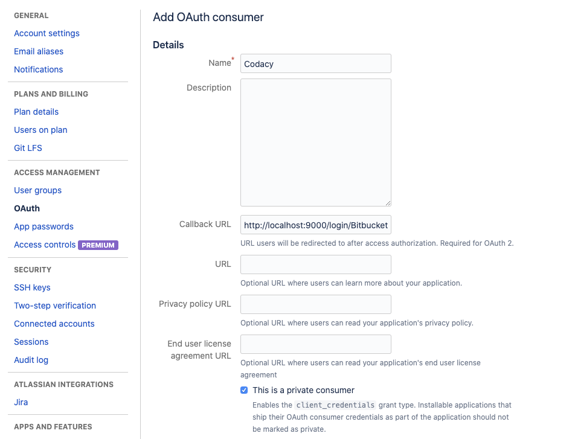
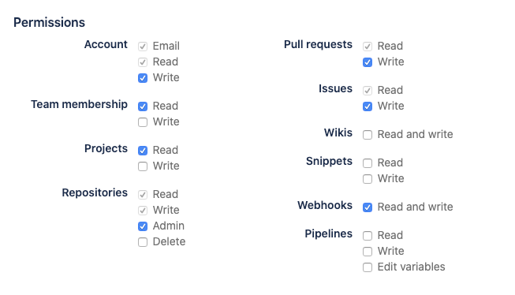

# Bitbucket

Since Bitbucket uses OAuth, the first step is to register a consumer for Codacy on Bitbucket side.

## Create a consumer
OAuth needs a key and secret, together these are known as an OAuth consumer. You can create a consumer on any existing individual or team account. To create a consumer, do the following:

  1. From your avatar in the bottom left, click Bitbucket settings.
  1. Click *"OAuth"* from the left navigation and click the *"Add consumer"* button.  
     1. Set the name of the consumer (e.g. *"Codacy"*).
     1. Set the callback URL as *"http://<codacy_url>:<codacy_port>/login/Bitbucket?codacy_skip_ga=1"*.
     1. Tick the *"This is a private consumer"* checkbox:
        
     1. Add the following permissions: 
     
     1. Click Save. 
        The system generates a key and a secret for you.
     1. Toggle the consumer name to see the generated Key and Secret value for your consumer.
     

## Enable Bitbucket and set the key and the secret
Set your configuration values for Bitbucket on the `values-production.yaml` file.

1. Enable Bitbucket by setting `enable` to `"true"`.
1. Copy the key from Bitbucket and set it in the `key` field.
1. Copy the secret from Bitbucket and set it in the `secret`field.  
   Example:
   ```yaml
   global:
   bitbucket:
      enabled: "true"
      key: "12345232123"
      secret: "54321abcxdawj4bfsdh3"
   ```
 1. Apply the configuration by issuing an helm upgrade.  
    Example:
    ```bash
    helm upgrade (...options used to install codacy...) \
    --values values-production.yaml
    ```