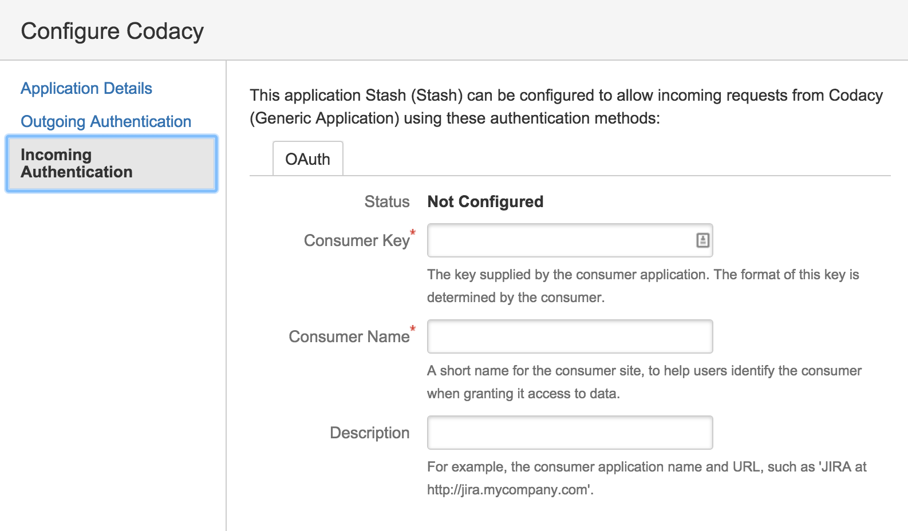

# Bitbucket Server Application Link

**NOTE:** Since Bitbucket Server uses OAuth1, you'll need to create a key pair to sign and validate the requests between Codacy and the Bitbucket Server instance:

## Generating the secrets

1. Create a key pair using the RSA algorithm in the PKCS#8 format by running the following commands below, making sure that you don't define a passphrase:

   ```bash
   bash <(curl -fsSL https://raw.githubusercontent.com/codacy/chart/master/docs/configuration/git-providers/generate-bitbucket-server-secrets.sh)
   ```

1.  Store the keys in a safe place for usage in the next steps and as a backup


## Bitbucket Server Application Link

To set up Bitbucket Server you need to create an application link on your Bitbucket Server installation.

### Application Link Creation

1. Open `<bitbucket server base url>/plugins/servlet/applinks/listApplicationLinks`, where `<bitbucket server base url>` is the base url of your own Bitbucket Server instance.
1. Create the link, use your Codacy installation URL for this


### Name the link

1. _Application Name_: You can name the application (ex: Codacy)
1. _Application Type_: The application type is Generic Application
1. The rest of the configuration should be left blank.


After the link is created, click edit to add an incoming connection.

### Add incoming connection

1. _Consumer Key_: This value should be copied from the `consumerKey` generated previously.
1. _Consumer Name_: You can choose any name (ex: Codacy).
1. _Public Key_: This value should be copied from the `consumerPublicKey` generated previously.
1. The rest of the fields should be left blank.



After the application link is created, you will be able to add Bitbucket Server as an integration in the repository settings.
