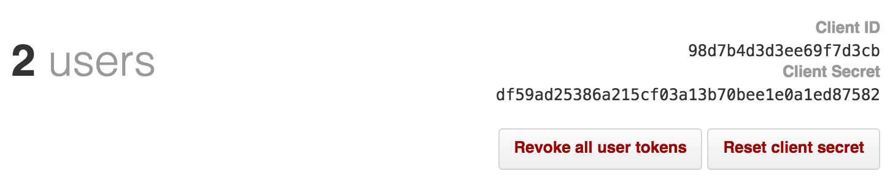

# GitHub Enterprise

Set your configuration values for your GitHub instance on the `values.yaml` file.
**Please note that you must go to `http://codacy.example.com/admin/integrations`, select the desired provider and `Test & Save` your configuration for it to be applied.**

## GitHub Application

To integrate with GitHub we use a GitHub OAuth Application.

To create the application on GitHub, visit **Settings / Developer settings / OAuth Apps / New OAuth App** and create an application pointing to your local Codacy deployment URL.

You can fill all the fields with the suggested text above or use your own text except for the field `Authorization callback URL` where you must insert your local Codacy deployment url.

The URL should contain the endpoint/IP, the protocol (HTTP or HTTPS), and, if applicable, the port where it is running.

Correct:

-   <http://your.codacy.url.com>
-   <http://your.codacy.url.com:9000>
-   <http://53.43.42.12gi>
-   <http://53.43.42.12:9000>

Incorrect:

-   your.codacy.url.com
-   your.codacy.url.com:9000
-   53.43.42.12
-   53.43.42.12:9000

### Token retrieval

After the application is created, you should copy both the `Client ID` and the `Client Secret` and paste them in the setup page on your Codacy Self-hosted.

After this is done you will be able to use GitHub Enterprise as an authentication method to add repositories and as an integration in the repository settings.
