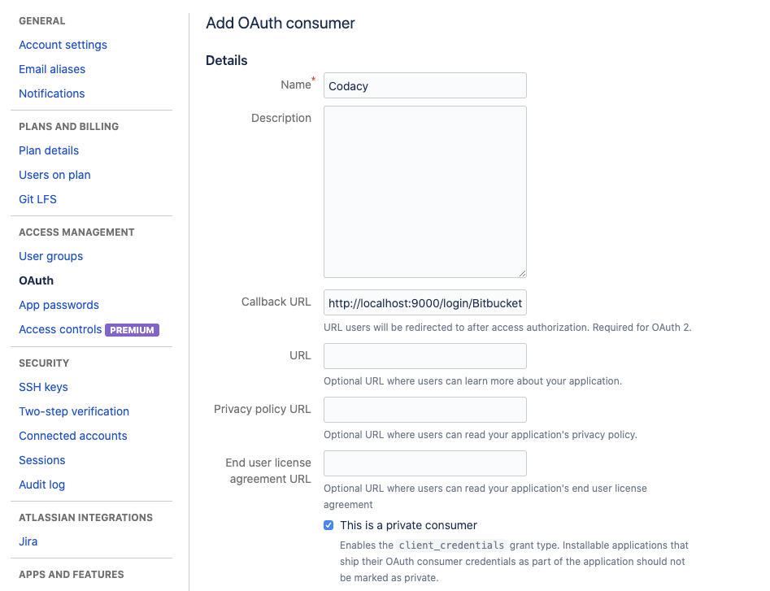
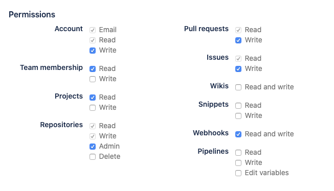

# Bitbucket Cloud

Follow the instructions below to set up the Codacy Self-hosted integration with Bitbucket Cloud.

## Create an OAuth consumer {: id="create-oauth"}

To integrate Codacy with Bitbucket Cloud, you must register an OAuth consumer for Codacy on Bitbucket.

You can create a consumer on any existing individual or team account. To create a consumer, do the following:

1.  On Bitbucket, click on your avatar on the bottom left-hand corner and select **Bitbucket settings**.

2.  Select **OAuth** on the left sidebar and click the button **Add consumer**.

3.  Fill in the fields to create the OAuth consumer:

    - **Name:** Name of the OAuth consumer. For example, `Codacy`.

    - **Callback URL:** Copy the URL below, replacing the HTTP protocol and hostname with the correct values for your Codacy instance.
    
        ```
        https://codacy.example.com/login/Bitbucket?codacy_skip_ga=1
        ```

    - **This is a private consumer:** Enable the check box.

    - Add the permissions:

        - **Account:** Write
        - **Team membership:** Read
        - **Projects:** Read
        - **Repositories:** Admin
        - **Pull requests:** Write
        - **Issues:** Write
        - **Webhooks:** Read and write

    

    

4. Click Save, and then click the name of the new OAuth consumer to take note of the generated key and secret.

   

## Configure Bitbucket Cloud on Codacy {: id="configure"}

After creating the OAuth consumer on Bitbucket Cloud, you must configure it on Codacy:

1.  Edit the file `values-production.yaml` that you [used to install Codacy](../../index.md#helm-upgrade).

2.  Set `global.bitbucket.enabled: "true"` and define the remaining values as described below using the information obtained when you created the OAuth consumer:

   ```yaml
   global:
     bitbucket:
       enabled: "true"
       login: "true" # Show login button for Bitbucket Cloud
       key: "" # OAuth consumer key
       secret: "" # OAuth consumer secret
   ```

3.  Apply the new configuration by performing a Helm upgrade. To do so execute the command [used to install Codacy](../../index.md#helm-upgrade):

    !!! important
        **If you're using MicroK8s** you must use the file `values-microk8s.yaml` together with the file `values-production.yaml`.
        
        To do this, uncomment the last line before running the `helm upgrade` command below.

    ```bash
    helm upgrade (...options used to install Codacy...) \
                 --version {{ version }} \
                 --values values-production.yaml \
                 # --values values-microk8s.yaml
    ```

After this is done you will be able to use Bitbucket Cloud to authenticate to Codacy.
