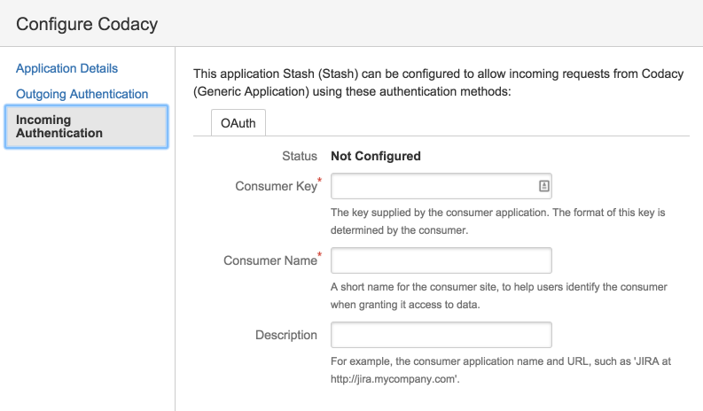

# Bitbucket Server

Follow the instructions below to set up the Codacy Self-hosted integration with Bitbucket Server.

## Create a Bitbucket Server application link

To integrate Codacy with Bitbucket Server, you must create an application link on your Bitbucket Server instance:

1.  Since Bitbucket Server uses OAuth1, you need to create a key pair to sign and validate the requests between Codacy and the Bitbucket Server instance.

    Create a key pair using the RSA algorithm in the PKCS#8 format by executing the command:

    ```bash
    bash <(curl -fsSL https://raw.githubusercontent.com/codacy/chart/master/docs/configuration/integrations/generate-bitbucket-server-secrets.sh)
    ```

    Store the keys in a safe place for usage in the next steps and as a backup.

2.  Open `<bitbucket server url>/plugins/servlet/applinks/listApplicationLinks`, where `<bitbucket server url>` is the URL of your Bitbucket Server instance.

3.  Create a new application link with the URL of your Codacy instance.

    

4.  Fill in the fields:

    -   **Application Name:** Name of the application. For example, `Codacy`.
    -   **Application Type:** Select `Generic Application`.

    The remaining fields should be left blank.

    

5.  After creating the link, click **Edit** to add an incoming authentication.

6.  Fill in the fields of the incomming authentication:

    -   **Consumer Key:** Enter the `consumerKey` generated previously.
    -   **Consumer Name:** Name of the consumer. For example, `Codacy`.
    -   **Public Key:** Enter the `consumerPublicKey` generated previously.

    The remaining fields should be left blank.

    

## Configure Bitbucket Server on Codacy

After creating the Bitbucket Server application link, you must configure it on Codacy:

1.  Edit the file `values-production.yaml` that you [used to install Codacy](../../index.md#helm-upgrade).

2.  Set `global.bitbucketEnterprise.enabled: "true"` and define the remaining values as described below and with the information obtained when you created the Bitbucket Server application link:

    ```yaml
    bitbucketEnterprise:
       enabled: "true"
       login: "true" # Show login button for Bitbucket Server
       hostname: "bitbucket.example.com" # Hostname of your Bitbucket Server instance
       protocol: "https" # Protocol of your Bitbucket Server instance
       port: 7990 # Port of your Bitbucket Server instance
       consumerKey: "" # Generated when creating the Bitbucket Server application link
       consumerPublicKey: "" # Generated when creating the Bitbucket Server application link
       consumerPrivateKey: "" # Generated when creating the Bitbucket Server application link
    ```

3.  Apply the new configuration by performing a Helm upgrade. To do so execute the command [used to install Codacy](../../index.md#helm-upgrade):

    !!! important
        **If you're using MicroK8s** you must use the file `values-microk8s.yaml` together with the file `values-production.yaml`.
        
        To do this, uncomment the last line before running the `helm upgrade` command below.

    ```bash
    helm upgrade (...options used to install Codacy...) \
                 --version {{ version }} \
                 --values values-production.yaml \
                 # --values values-microk8s.yaml
    ```

After this is done you will be able to use Bitbucket Server to authenticate to Codacy.
