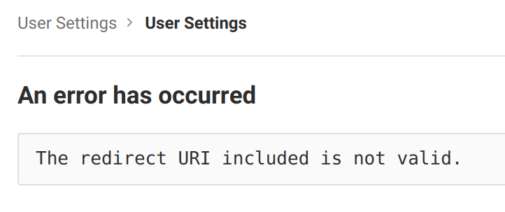
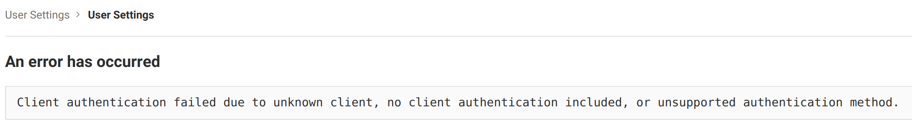

# GitLab Cloud

## Setup

Follow the instructions below to set up the Codacy integration with GitLab Cloud:

1.  Create a [new application](https://gitlab.com/profile/applications) pointing to your local Codacy deployment URL with `api`, `read user` and `read repository` scopes.

    You'll need to add the following 'Redirect URI'. Make sure to update your protocol to use either http or https and your hostname as well. Keep in mind this field is case sensitive.

    ```
    https://codacy.example.com/login/GitLab
    https://codacy.example.com/add/addPermissions/GitLab
    https://codacy.example.com/add/addProvider/GitLab
    https://codacy.example.com/add/addService/GitLab
    ```

2.  Edit the file `values-production.yaml`, set `global.gitlab.enabled: "true"` and define the remaining values with the information obtained when you created the GitLab Application:

    ```yaml
    gitlab:
      enabled: "true"
      login: "true" # Show login button for GitLab
      clientId: a000000000000000 # Client ID
      clientSecret: a000000000000000 # Client secret
    ```

3.  Apply this configuration by performing a Helm upgrade. To do so append `--values values-production.yaml` to the command [used to install Codacy](../../index.md#2-installing-codacy):

    ```bash
    helm upgrade (...options used to install Codacy...) \
                 --values values-production.yaml
    ```

After this is done you will be able to use GitLab Cloud to authenticate to Codacy.

## Troubleshooting

- During an authentication procedure, if you got stuck on the provider and this message is shown
  - 
    It means you have not introduced correctly, the redirect uris when creating the application in GitLab.com
    - Make sure all the urls have the correct Codacy protocol (http or http)
    - Make sure all the urls have the full path with the correct case (it is case sensitive)
    - If you still could not find the problem:
        - Extract the parameter `redirect_uri`, from the browser address bar in GitLabEnterprise where the error appears (e.g.: `https%3A%2F%codacy.example.com%2Flogin%2FGitLabEnterprise`)
        - Decode the value (e.g.: [urldecoder.com](https://www.urldecoder.org/)) (e.g.: `https://codacy.example.com/login/GitLab`)
        - Check if the value matches one of the configured ones in the application in GitLab.com
  - 
    It means you have not introduced the application id when configuring GitLab.com on Codacy.
    - Make sure the value matches the one in your GitLab.com application
    - If you still could not find the problem:
        - Extract the parameter `client_id`, from the browser address bar in GitLab.com where the error appears (e.g.: `cca35a2a1f9b9b516ac927d82947bd5149b0e57e922c9e5564ac092ea16a3ccd`)
        - Check if the application id on GitLab.com matches this value
- If you do not understand why they are different, contact [support@codacy.com](mailto:support@codacy.com)
  with all the previous information so they can help you
