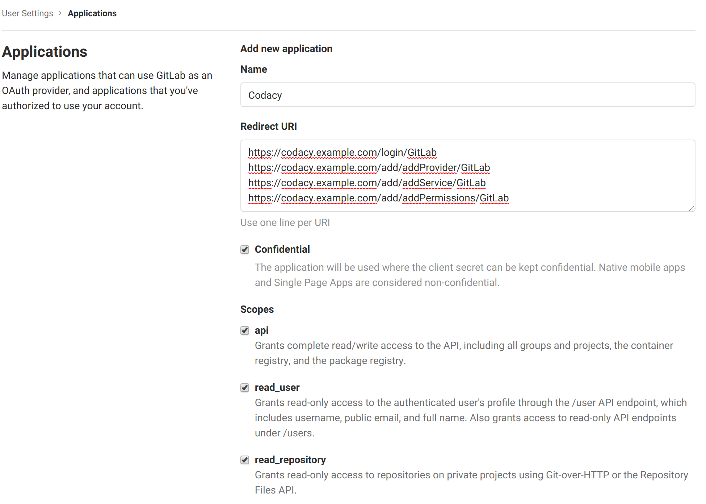
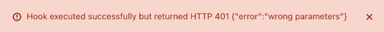

# GitLab Cloud

Follow the instructions below to set up the Codacy Self-hosted integration with GitLab Cloud.

## Create a GitLab application {: id="create-application"}

To integrate Codacy with GitLab Cloud, you must create a GitLab application:

1.  Open <https://gitlab.com/profile/applications>.

2.  Fill in the fields to register your Codacy instance on GitLab:

    -   **Name:** Name of the application. For example, `Codacy`.

    -   **Redirect URI:** Copy the URLs below, replacing the HTTP protocol and hostname with the correct values for your Codacy instance. This field is case sensitive.

        ```text
        https://codacy.example.com/login/GitLab
        https://codacy.example.com/add/addProvider/GitLab
        https://codacy.example.com/add/addService/GitLab
        https://codacy.example.com/add/addPermissions/GitLab
        ```

    -   **Scopes:** Enable the scopes:
    
        -   `api`
        -   `read_user`
        -   `read_repository`
        -   `openid`

    

3.  Click **Save application** and take note of the generated Application Id and Secret.

!!! note
    You can ignore the following error that GitLab may display when you test or save the new GitLab application:

    

    This happens because GitLab tests the new application by calling an endpoint that Codacy doesn't implement.

## Configure GitLab Cloud on Codacy {: id="configure"}

After creating the GitLab application, you must configure it on Codacy:

1.  Edit the file `values-production.yaml` that you [used to install Codacy](../../index.md#helm-upgrade).

2.  Set `global.gitlab.enabled: "true"` and define the remaining values as described below using the information obtained when you created the GitLab application:

    ```yaml
    gitlab:
      enabled: "true"
      login: "true" # Show login button for GitLab Cloud
      clientId: "" # Application ID
      clientSecret: "" # Secret
    ```

3.  Apply the new configuration by performing a Helm upgrade. To do so execute the command [used to install Codacy](../../index.md#helm-upgrade):

    !!! important
        **If you're using MicroK8s** you must use the file `values-microk8s.yaml` together with the file `values-production.yaml`.
        
        To do this, uncomment the last line before running the `helm upgrade` command below.

    ```bash
    helm upgrade (...options used to install Codacy...) \
                 --version {{ version }} \
                 --values values-production.yaml \
                 # --values values-microk8s.yaml
    ```

After this is done you will be able to use GitLab Cloud to authenticate to Codacy.
