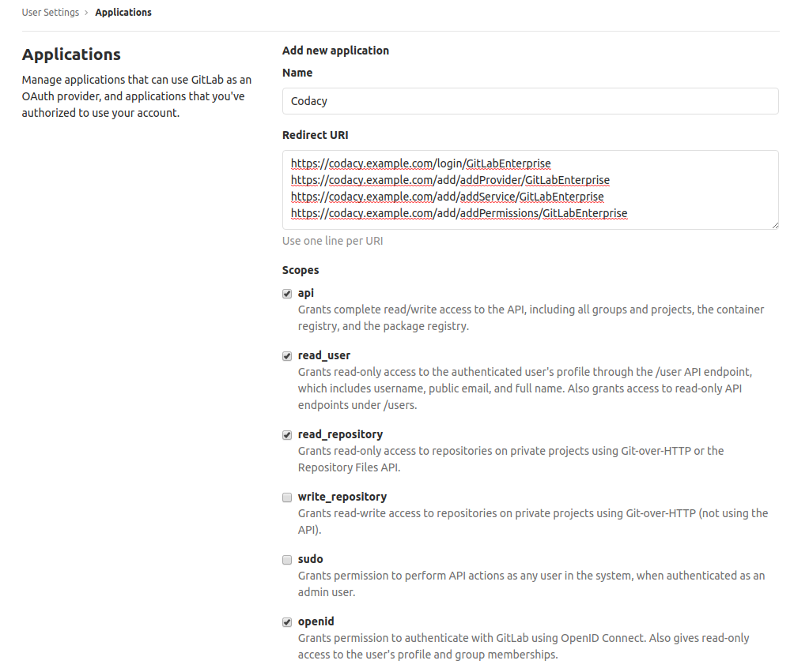
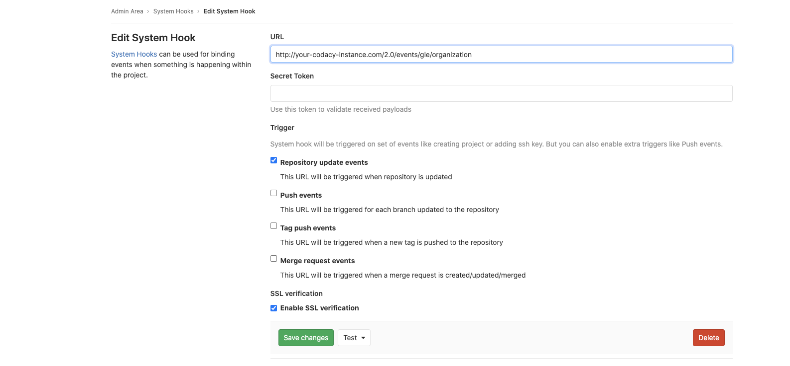

# GitLab Enterprise

Follow the instructions below to set up the Codacy Self-hosted integration with GitLab Enterprise:

## Create a GitLab application {: id="create-application"}

To integrate Codacy with GitLab Enterprise, you must create a GitLab application:

1.  Open `<gitlab enterprise url>/profile/applications` as a GitLab admin, where `<gitlab enterprise url>` is the URL of your GitLab Enterprise instance.

2.  Fill in the fields to register your Codacy instance on GitLab:

    -   **Name:** Name of the application. For example, `Codacy`.

    -   **Redirect URI:** Copy the URLs below, replacing the HTTP protocol and hostname with the correct values for your Codacy instance. This field is case sensitive.

        ```text
        https://codacy.example.com/login/GitLabEnterprise
        https://codacy.example.com/add/addProvider/GitLabEnterprise
        https://codacy.example.com/add/addService/GitLabEnterprise
        https://codacy.example.com/add/addPermissions/GitLabEnterprise
        ```

    -   **Scopes:** Enable the scopes:
    
        -   `api`
        -   `read_user`
        -   `read_repository`
        -   `openid`

    

3.  Click **Save application** and take note of the generated Application Id and Secret.

!!! note
    You can ignore the following error that GitLab Enterprise may display when you test or save the new GitLab application:

    

    This happens because GitLab Enterprise tests the new application by calling an endpoint that Codacy doesn't implement.

## Configure GitLab Enterprise on Codacy {: id="configure"}

After creating the GitLab application, you must configure it on Codacy:

1.  Edit the file `values-production.yaml` that you [used to install Codacy](../../index.md#helm-upgrade).

2.  Set `global.gitlabEnterprise.enabled: "true"` and define the remaining values as described below using the information obtained when you created the GitLab application:

    ```yaml
    gitlabEnterprise:
      enabled: "true"
      login: "true" # Show login button for GitLab Enterprise
      hostname: "gitlab.example.com" # Hostname of your GitLab Enterprise instance
      protocol: "https" # Protocol of your GitLab Enterprise instance
      port: 443 # Port of your GitLab Enterprise instance
      clientId: "" # Application ID
      clientSecret: "" # Secret
    ```

3.  Apply the new configuration by performing a Helm upgrade. To do so execute the command [used to install Codacy](../../index.md#helm-upgrade):

    !!! important
        **If you're using MicroK8s** you must use the file `values-microk8s.yaml` together with the file `values-production.yaml`.
        
        To do this, uncomment the last line before running the `helm upgrade` command below.

    ```bash
    helm upgrade (...options used to install Codacy...) \
                 --version {{ version }} \
                 --values values-production.yaml \
                 # --values values-microk8s.yaml
    ```

After this is done you will be able to use GitLab Enterprise to authenticate to Codacy.

## Detect changes to repositories and organizations

Optionally, Codacy can automatically detect the following changes to repositories and organizations on your GitLab Enterprise instance:

-   **For repositories:** renames, deletes, and visibility changes
-   **For organizations:** renames, deletes, and access removed

To do this, you must configure a [System Hook](https://docs.gitlab.com/ee/system_hooks/system_hooks.html) on your GitLab Enterprise instance to notify Codacy of the changes:

1.  Open `<gitlab enterprise url>/admin/hooks` as a GitLab admin, where `<gitlab enterprise url>` is the URL of your GitLab Enterprise instance.

2.  Fill in the fields to create the System Hook:

    -   **URL:** The URL of your Codacy instance with the path `/2.0/events/gle/organization`. For example, `http://codacy.example.com/2.0/events/gle/organization`

    -   **Secret Token:** Copy the Application Secret from the GitLab application that you created previously, or from the value of `clientSecret` in the file `values-production.yaml` that you used to install Codacy.

    -   **Trigger:** Enable the trigger `Repository update events`
    
    -   **SSL verification:** Enable the SSL verification.

    

3.  Click **Save Changes** to save the System Hook.
