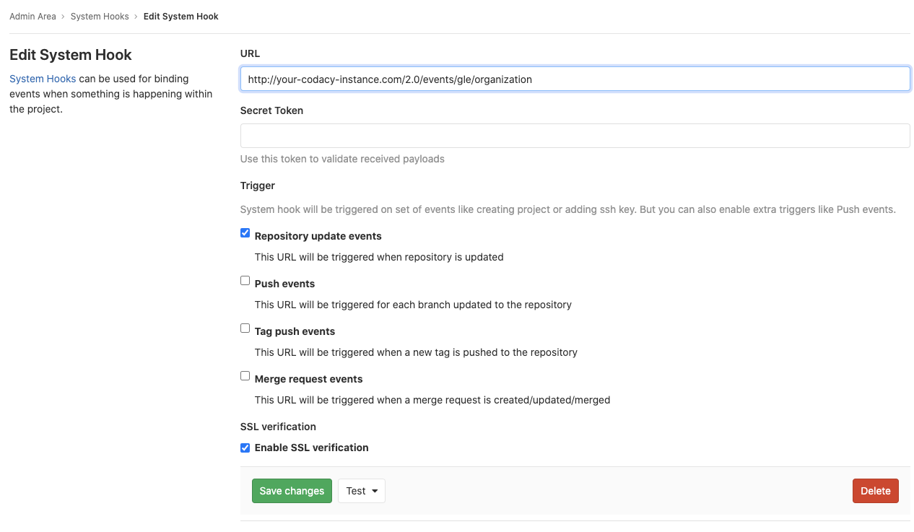

# GitLab Enterprise

Follow the instructions below to set up the Codacy integration with GitLab Enterprise:

## Create a GitLab application {id="create-application"}

To integrate Codacy with GitLab Enterprise, you must create a GitLab application:

1.  Open `<gitlab enterprise url>/profile/applications`, where `<gitlab enterprise url>` is the URL of your GitLab Enterprise instance.

2.  Fill in the fields to register your Codacy instance on GitLab:

    -   **Name:** Name of the application. For example, `Codacy`.

    -   **Redirect URI:** Copy the URLs below, replacing the HTTP protocol and hostname with the correct values for your Codacy instance. This field is case sensitive.

        ```text
        https://codacy.example.com/login/GitLabEnterprise
        https://codacy.example.com/add/addService/GitLabEnterprise
        https://codacy.example.com/add/addPermissions/GitLabEnterprise
        ```

    -   **Scopes:** Enable the scopes:
    
        -   `api`
        -   `read_user`
        -   `read_repository`
        -   `openid`

    

3.  Click **Save application** and take note of the generated Application Id and Secret.

## Configure GitLab Enterprise on Codacy {id="configure"}

After creating the GitLab application, you must configure it on Codacy:

1.  Edit the file `values-production.yaml` that you [used to install Codacy](../../index.md#helm-upgrade).

2.  Set `global.gitlabEnterprise.enabled: "true"` and define the remaining values as described below using the information obtained when you created the GitLab application:

    ```yaml
    gitlabEnterprise:
      enabled: "true"
      login: "true" # Show login button for GitLab Enterprise
      hostname: "gitlab.example.com" # Hostname of your GitLab Enterprise instance
      protocol: "https" # Protocol of your GitLab Enterprise instance
      port: 443 # Port of your GitLab Enterprise instance
      clientId: "" # Application ID
      clientSecret: "" # Secret
    ```

3.  Apply the new configuration by performing a Helm upgrade. To do so execute the command [used to install Codacy](../../index.md#helm-upgrade):

    !!! important
        **If you are using MicroK8s** you must use the file `values-microk8s.yaml` together with the file `values-production.yaml`.
        
        To do this, uncomment the last line before running the `helm upgrade` command below.

    ```bash
    helm upgrade (...options used to install Codacy...) \
                 --values values-production.yaml \
                 # --values values-microk8s.yaml
    ```

After this is done you will be able to use GitLab Enterprise to authenticate to Codacy.

## System Hooks

In order to detect changes on the repositories (renames, deletes and visibility changes) and on the organizations (renames, deletes and access removed), 
you need to configure a System Hook on your GitLab Enterprise instance:

1. Login into your GitLab Enterprise instance as an admin, and then on the "Admin Area" click on "System Hooks".


2. Fill in the fields to create the System Hook:

    -   **URL:** The URL of your codacy instance with the path `/2.0/events/gle/organization`. Example: `http://your-codacy-instance.com/2.0/events/gle/organization`

    -   **Secret Token:** Copy the `clientSecret` you configured previously on the file `values-production.yaml` (or `values-microk8s.yaml`, if you're using microk8s) that you [used to install Codacy](../../index.md#helm-upgrade).

    -   **Trigger:** Enable the trigger:
    
        -   `Repository update events`
    
    -   **SSL verification:** Enable the SSL verification.

    

3. Click on "Save Changes" to save the System Hook.