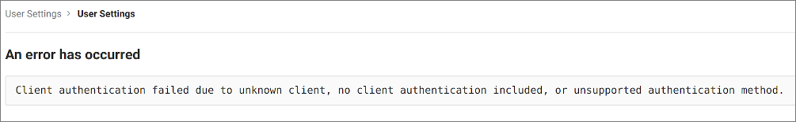

# Troubleshooting

The sections below include information to help you troubleshoot issues that you may come across while configuring the Codacy integration with your Git provider.

If the information provided on this page is not enough to solve your issue, contact [support@codacy.com](mailto:support@codacy.com) with all the information that you were able to collect while following the troubleshooting instructions so we can help you.

## GitHub Cloud and GitHub Enterprise authentication {id="github"}

While trying to authenticate Codacy on GitHub you get the following error message:

This means that there is a mismatch in the Client ID that Codacy is using to authenticate on GitHub.

**To solve this issue:**

1.  Make sure that the value of `clientId` in your `values-production.yaml` is the same as the Client ID of the [GitHub App that you created](github-app-create.md)
2.  If the values were different, you need to re-execute the `helm upgrade` command as described for [GitHub Cloud](github-cloud.md) or [GitHub Enterprise](github-enterprise.md)

If the error persists:

1.  Take note of the parameter `client_id` in the URL of the GitHub error page (for example, `Iv1.0000000000000000`)
2.  Check if the value of the parameter matches the value of the Client ID

## GitLab Cloud and GitLab Enterprise authentication {id="gitlab"}

### Invalid redirect URI

While trying to authenticate Codacy on GitLab you get the following error message:

This means that the redirect URIs are not correct in the GitLab application that Codacy is using to authenticate on GitLab.

**To solve this issue:**

1.  Open the GitLab application that you created on [GitLab Cloud](gitlab-cloud.md#create-a-gitlab-application) or [GitLab Enterprise](gitlab-enterprise.md#create-a-gitlab-application)
2.  Make sure that all the redirect URIs have the correct Codacy protocol, either `http://` or `https://`
3.  Make sure that all the redirect URIs have the full path with the correct case, since the field is case-sensitive

If the error persists:

1.  Take note of the parameter `redirect_uri` in the URL of the GitLab error page (for example, `https%3A%2F%codacy.example.com%2Flogin%2FGitLab` or `https%3A%2F%codacy.example.com%2Flogin%2FGitLabEnterprise`)
2.  Decode the value of the parameter using a tool such as [urldecoder.com](https://www.urldecoder.org/) (for example, `https://codacy.example.com/login/GitLab` or `https://codacy.example.com/login/GitLabEnterprise`)
3.  Check if the decoded value matches one of the redirect URIs in the GitLab application

### Invalid Application ID

While trying to authenticate Codacy on GitLab you get the following error message:

This means that there is a mismatch in the Application ID that Codacy is using to authenticate on GitLab.

**To solve this issue:**

1.  Make sure that the value of `clientId` in your `values-production.yaml` is the same as the Application ID of the [GitLab Cloud](gitlab-cloud.md#create-a-gitlab-application) or [GitLab Enterprise](gitlab-enterprise.md#create-a-gitlab-application) application that you created
2.  If the values were different, you need to re-execute the `helm upgrade` command as described for [GitLab Cloud](gitlab-cloud.md#configure-gitLab-cloud-on-codacy) or [GitLab Enterprise](gitlab-enterprise.md#configure-gitLab-cloud-on-codacy)

If the error persists:

1.  Take note of the parameter `client_id` in the URL of the GitLab error page (for example, `cca35a2a1f9b9b516ac927d82947bd5149b0e57e922c9e5564ac092ea16a3ccd`)
2.  Check if the value of the parameter matches the value of the Application ID

## Bitbucket Cloud authentication {id="bitbucket-cloud"}

While trying to authenticate Codacy on Bitbucket Cloud you get the following error message:

This means that there is a mismatch in the `client_id` that Codacy is using to authenticate on Bitbucket Cloud.

**To solve this issue:**

1.  Make sure that the value of `key` in your `values-production.yaml` is the same as the Key of the [Bitbucket OAuth consumer that you created](bitbucket-cloud.md#create-an-oauth-consumer)
2.  If the values were different, you need to re-execute the `helm upgrade` command as described for [Bitbucket Cloud](bitbucket-cloud.md#configure-bitbucket-cloud-on-codacy)

If the error persists:

1.  Take note of the parameter `client_id` in the URL of the Bitbucket Cloud error page (for example, `r8QJDkkxj8unYfg4Bd`)
2.  Check if the value of the parameter matches the value of the Client ID
