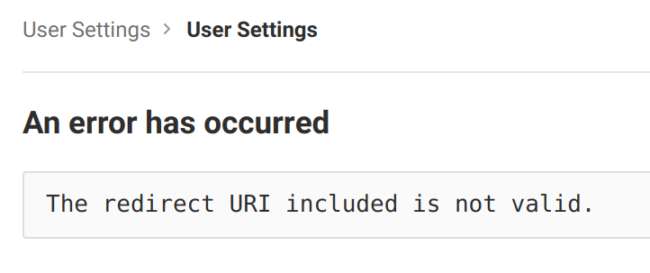
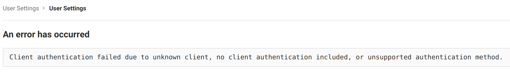
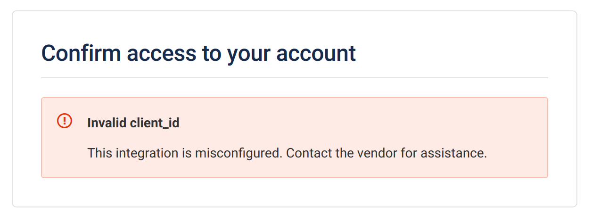

# Troubleshooting

If you do not understand why they are different, contact [support@codacy.com](mailto:support@codacy.com) with all the previous information so they can help you.

## GitHub Cloud

- During an authentication procedure, if you got stuck on the provider and this message is shown
  - 
    It means you have not introduced the client id when configuring GitHub.com on Codacy.
    - Make sure the value matches the one in your GitHub.com application
    - If you still could not find the problem:
        - Extract the parameter `client_id`, from the browser address bar in GitHub.com where the error appears (e.g.: `Iv1.0000000000000000`)
        - Check if the application id on GitHub.com matches this value

## GitHub Enterprise

- During an authentication procedure, if you got stuck on the provider and this message is shown
  - 
    It means you have not introduced the client id when configuring GitHubEnterprise on Codacy.
    - Make sure the value matches the one in your GitHubEnterprise application
    - If you still could not find the problem:
        - Extract the parameter `client_id`, from the browser address bar in GitHubEnterprise where the error appears (e.g.: `Iv1.0000000000000000`)
        - Check if the application id on GitHubEnterprise matches this value

## GitLab Cloud

- During an authentication procedure, if you got stuck on the provider and this message is shown
  - 
    It means you have not introduced correctly, the redirect uris when creating the application in GitLab.com
    - Make sure all the urls have the correct Codacy protocol (http or http)
    - Make sure all the urls have the full path with the correct case (it is case sensitive)
    - If you still could not find the problem:
        - Extract the parameter `redirect_uri`, from the browser address bar in GitLabEnterprise where the error appears (e.g.: `https%3A%2F%codacy.example.com%2Flogin%2FGitLabEnterprise`)
        - Decode the value (e.g.: [urldecoder.com](https://www.urldecoder.org/)) (e.g.: `https://codacy.example.com/login/GitLab`)
        - Check if the value matches one of the configured ones in the application in GitLab.com
  - 
    It means you have not introduced the application id when configuring GitLab.com on Codacy.
    - Make sure the value matches the one in your GitLab.com application
    - If you still could not find the problem:
        - Extract the parameter `client_id`, from the browser address bar in GitLab.com where the error appears (e.g.: `cca35a2a1f9b9b516ac927d82947bd5149b0e57e922c9e5564ac092ea16a3ccd`)
        - Check if the application id on GitLab.com matches this value

## GitLab Enterprise

- During an authentication procedure, if you got stuck on the provider and this message is shown
  - 
    It means you have not introduced correctly, the redirect uris when creating the application in GitLabEnterprise
    - Make sure all the urls have the correct Codacy protocol (http or http)
    - Make sure all the urls have the full path with the correct case (it is case sensitive)
    - If you still could not find the problem:
        - Extract the parameter `redirect_uri`, from the browser address bar in GitLabEnterprise where the error appears (e.g.: `https%3A%2F%codacy.example.com%2Flogin%2FGitLabEnterprise`)
        - Decode the value (e.g.: [urldecoder.com](https://www.urldecoder.org/)) (e.g.: `https://codacy.example.com/login/GitLabEnterprise`)
        - Check if the value matches one of the configured ones in the application in GitLabEnterprise
  - 
    It means you have not introduced the application id when configuring GitLabEnterprise on Codacy.
    - Make sure the value matches the one in your GitLabEnterprise application
    - If you still could not find the problem:
        - Extract the parameter `client_id`, from the browser address bar in GitLabEnterprise where the error appears (e.g.: `cca35a2a1f9b9b516ac927d82947bd5149b0e57e922c9e5564ac092ea16a3ccd`)
        - Check if the application id on GitLabEnterprise matches this value

## Bitbucket Cloud

- During an authentication procedure, if you got stuck on the provider and this message is shown
  - 
    It means you have not introduced the client id when configuring Bitbucket.com on Codacy.
    - Make sure the value matches the one in your Bitbucket.com application
    - If you still could not find the problem:
        - Extract the parameter `client_id`, from the browser address bar in Bitbucket.com where the error appears (e.g.: `r8QJDkkxj8unYfg4Bd`)
        - Check if the application id on Bitbucket.com matches this value
