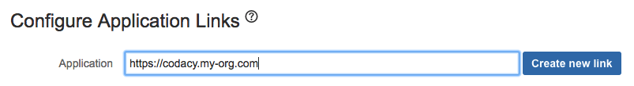
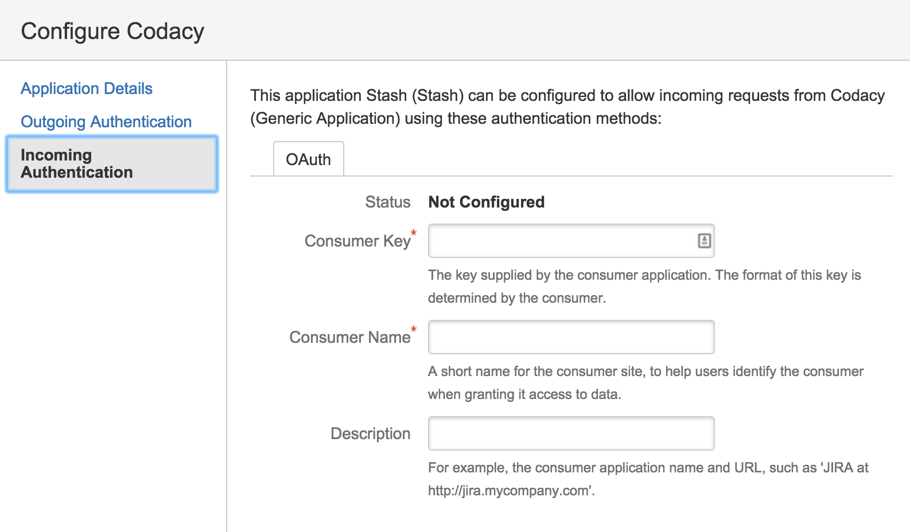

# Bitbucket Stash

Set the following configurations from your Bitbucket instance on the `values.yaml` file:

```yaml
global:
  bitbucketEnterprise:
      hostname: "CHANGE_ME"
      protocol: "CHANGE_ME"
```
**Please note that you must go to `http://codacy.example.com/admin/integrations`, select the desired provider and `Test & Save` your configuration for it to be applied.**

Go to `admin/integration` on Codacy and set the **Project Keys** on the Bitbucket Server integration, these should be the keys of the projects you would like to retrieve repositories of.




## Stash Application Link

To set up Stash you need to create an application link on your Stash installation.
You can click on here and go to the application links list.

### Application Link Creation

Create the link, use your Codacy installation URL for this


### Name the link

_Application Name_: You can name the application (ex: Codacy)

_Application Type_: The application type is Generic Application

The rest of the configuration should be left blank.


After the link is created, click edit to add an incoming connection.

### Add incoming connection

_Consumer Key_: This value should be copied from the "Client ID" field in the Codacy setup page.

_Consumer Name_: You can choose any name (ex: Codacy).

_Public Key_: This value should be copied from the "Client Secret" field on the Codacy setup page.

The rest of the fields can be left blank.



After the application link is created, you will be able to add Bitbucket Server as an integration in the repository settings.
