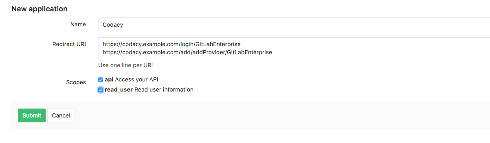
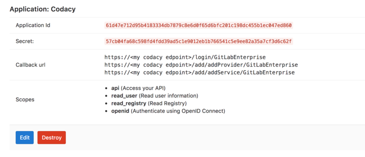

# GitLab Enterprise

Set the following configurations from your GitLab instance on the values.yaml file:

    ```
    gitLabEnterprise:
        hostname: "CHANGE_ME"
        protocol: "CHANGE_ME"
    ```

## GitLab Application

To integrate with GitHub we use a GitLab Application.

Create an application pointing to your local Codacy deployment URL.

You'll need to add the following 'Redirect URI'. Make sure to update your protocol to use either http or https and your domain name as well. Keep in mind this field is case sensitive. 

`https://codacy.example.com/login/GitLabEnterprise`

`https://codacy.example.com/add/addProvider/GitLabEnterprise`

`https://codacy.example.com/add/addService/GitLabEnterprise`



Then paste the application ID and secret in Codacy Self-hosted.

