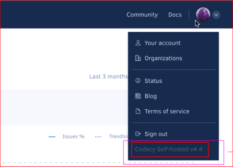

# Upgrading Codacy

To upgrade Codacy to the latest stable version:

1.  Check the [release notes](/release-notes/) for all Codacy Self-hosted versions between your current version and the most recent version for breaking changes and follow the instructions provided carefully.

    !!! warning
        Failing to follow the steps to deal with breaking changes can cause the upgrade to fail or cause problems while Codacy is running.

    !!! tip
        Click your avatar on the top right-hand corner of any Codacy page to see the version of your Codacy Self-hosted instance:

        

2.  Store all your currently defined configuration values in a file:

    ```bash
    helm get values codacy \
                    --namespace codacy \
                    --output yaml > codacy.yaml

    ```

    !!! note
        If you installed Codacy on a Kubernetes namespace different from `codacy`, make sure that you adjust the namespace when executing the commands in this page.

3.  Review the values stored in the file `codacy.yaml`, making any changes if necessary.

4.  Perform the upgrade using the values stored in the file:

    ```bash
    helm upgrade codacy codacy-stable/codacy \
                 --namespace codacy \
                 --values codacy.yaml
    ```
