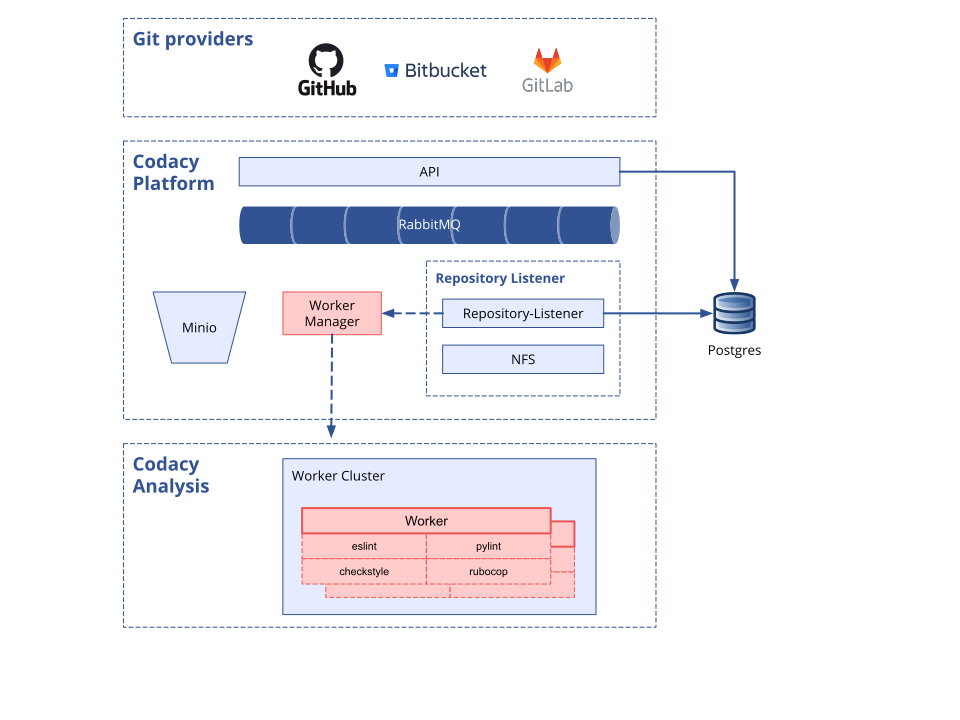

# System requirements

Before installing Codacy you must ensure that you have the following infrastructure correctly provisioned and configured:

-   A [Kubernetes or MicroK8s cluster](#kubernetes-or-microK8s-cluster-setup)
-   A [PostgreSQL server](#postgresql-server-setup)

The next sections describe in detail how to set up these system requirements.

## Kubernetes or MicroK8s cluster setup

-   A Kubernetes 1.14.\* or 1.15.\* cluster provisioned with the [required resources](#hardware-requirements)
-   The [NGINX Ingress Controller](https://github.com/helm/charts/tree/master/stable/nginx-ingress) correctly setup in your cluster
-   Helm

### Hardware requirements

The following high-level architecture is important in understanding how Codacy uses and allocates hardware resources.

You can look at Codacy separately as the **"Platform"** and the **"Analysis"**. The Platform contains the UI and other
components important to treat and show results. The Analysis is the swarm of workers that depending on the characteristics of you projects (languages, number of files, etc..) will run **up to** 4 linters at
the same time.

**The resources needed for Codacy depend a lot on the rate of commits done by your team.**



#### Virtual CPUs and memory

Since all components are running on Kubernetes, you can increase the number of replicas in every deployment to give you more resilience and throughput, at a cost of increased resource usage. The following is a simplified overview of how to calculate resource allocation for the **"Platform"** and the **"Analysis"**:

| Component                             | vCPU                    | Memory                      |
| ------------------------------------- | ----------------------- | --------------------------- |
| Platform (1 replica per component)    | 4                       | 8 GB                        |
| Analysis Worker + **up to** 4 linters | 5 (per Analysis Worker) | 10 GB (per Analysis Worker) |

##### Standard Cluster Installation

The resources described on the following table are based on our experience and are also the defaults in the [values-production.yaml](https://raw.githubusercontent.com/codacy/chart/master/codacy/values-production.yaml) file, which you might need to adapt taking into account your use case.

| Installation type                        | Replicas per component | Max. commits analyzed concurrently | Platform vCPUs | Platform Memory | Analysis Workers vCPUs | Analysis Workers Memory | ~ Total vCPUs | ~ Total Memory |
| ---------------------------------------- | ---------------------- | ---------------------------------- | -------------- | --------------- | ---------------------- | ----------------------- | ------------- | -------------- |
| Kubernetes Small Installation            | 1                      | 2                                  | 4              | 8 GB            | 10                     | 20 GB                   | 16            | 32 GB          |
| Kubernetes Medium Installation (default) | 2                      | 4                                  | 8              | 16 GB           | 20                     | 40 GB                   | 32            | 64 GB          |
| Kubernetes Big Installation              | 2+                     | 10+                                | 8+             | 16+ GB          | 50+                    | 100+ GB                 | 60+           | 110+ GB        |

**NOTE:**
For microk8s we added 1.5 CPU and 1.5 GB extra in the "Platform" meant to be used by microk8s itself.

| Installation type              | ~ Replicas per component | Max. commits analyzed concurrently | Platform vCPUs | Platform Memory | Analysis Workers vCPUs | Analysis Workers Memory | Total vCPUs | ~ Total Memory |
| ------------------------------ | ------------------------ | ---------------------------------- | -------------- | --------------- | ---------------------- | ----------------------- | ----------- | -------------- |
| MicroK8s Minimum               | 1 1                      | 2                                  | 5.5            | 9.5 GB          | 10                     | 20 GB                   | 6           | 32 GB          |
| MicroK8s Recommended (default) | 2 1-2                    | 2                                  | 11+            | 20+ GB          | 10                     | 20 GB                   | 0+          | 32+ GB         |

### Storage

The storage requirements depend mainly on the number of repositories you will be analyzing.
Use the following table as a guideline to determine Codacy's storage requirements.

| Component | Bundled in the chart         | Minimum Recommended |
| --------- | ---------------------------- | ------------------- |
| NFS       | Yes                          | 200 GB              |
| RabbitMQ  | Yes                          | 8 GB                |
| Minio     | Yes                          | 20 GB               |
| Postgres  | No (external DB recommended) | 500 GB+             |

For a custom recommendation, please contact us at [support@codacy.com](mailto://support@codacy.com).


## PostgreSQL server setup

-   A [PostgreSQL server](#external-postgresql-instance) accessible from the Kubernetes cluster

Codacy requires a working PostgreSQL instance to persist data.

Google, the developer of Kubernetes [doesn't recommend running database servers on your cluster](https://cloud.google.com/blog/products/databases/to-run-or-not-to-run-a-database-on-kubernetes-what-to-consider). As such, consider using a managed a solution like AWS RDS or Google Cloud SQL, or running the PostgreSQL server inside a dedicated virtual machine.

The following are the minimum recommended specifications of the PostgreSQL instance:

| vCPUs | Memory | Storage | Max. concurrent connections |
| ----- | ------ | ------- | --------------------------- |
| 4     | 8 GB   | 500 GB+ | 300                         |

### Setup

We recommend that you create a dedicated user for Codacy, with access permissions only to the databases that are specific to Codacy:

1.  Connect to the PostgreSQL server as a database admin user. For example, using the `psql` command-line client:

    ```bash
    psql -U postgres -h <PostgreSQL server hostname>
    ```

2.  Execute the SQL script below to create the dedicated user and the databases required by Codacy. Make sure that you change the user name and password to suit your security needs.

    ```sql
    CREATE USER codacy WITH PASSWORD 'codacy';
    ALTER ROLE codacy WITH CREATEDB;
    ```

3.  Make sure that you can connect to the PostgreSQL database using the newly created user. For example:

    ```bash
    psql -U codacy -d postgres -h <PostgreSQL server hostname>
    ```

4.  Create the necessary databases:

    ```sql
    CREATE DATABASE accounts WITH OWNER=codacy;
    CREATE DATABASE analysis WITH OWNER=codacy;
    CREATE DATABASE results WITH OWNER=codacy;
    CREATE DATABASE metrics WITH OWNER=codacy;
    CREATE DATABASE filestore WITH OWNER=codacy;
    CREATE DATABASE jobs WITH OWNER=codacy;
    CREATE DATABASE activities WITH OWNER=codacy;
    CREATE DATABASE hotspots WITH OWNER=codacy;
    CREATE DATABASE listener WITH OWNER=codacy;
    CREATE DATABASE crow WITH OWNER=codacy;
    ```
