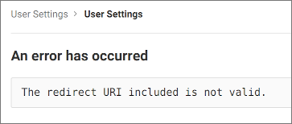

# Troubleshooting Codacy

This page includes information to help you troubleshoot issues that you may come across while installing, configuring, and operating Codacy.

If the information provided on this page is not enough to solve your issue, contact [support@codacy.com](mailto:support@codacy.com) providing:

-   The description of the issue
-   All the information that you were able to obtain while following these troubleshooting instructions
-   The [collected logs](logs-collect.md) of your Codacy instance

## Git provider integrations

The following sections help you troubleshoot the integration of Codacy with your Git provider.

### GitHub Cloud and GitHub Enterprise authentication {id="github"}

#### 404 error

While trying to authenticate on GitHub you get the following error message:


This might mean that there is a mismatch in the Client ID that Codacy is using to authenticate on GitHub.

To solve this issue:

1.  Make sure that the value of `clientId` in your `values-production.yaml` file is the same as the Client ID of the [GitHub App that you created](../configuration/integrations/github-app-create.md)
2.  If the values were different, update your configuration and re-execute the `helm upgrade` command as described for [GitHub Cloud](../configuration/integrations/github-cloud.md) or [GitHub Enterprise](../configuration/integrations/github-enterprise.md)

If the error persists:

1.  Take note of the parameter `client_id` in the URL of the GitHub error page (for example, `Iv1.0000000000000000`)
2.  Check if the value of the parameter matches the value of the Client ID of your GitHub App

### GitLab Cloud and GitLab Enterprise authentication {id="gitlab"}

#### Invalid redirect URI

While trying to authenticate on GitLab you get the following error message:



This might mean that the redirect URIs are not correct in the GitLab application that Codacy is using to authenticate on GitLab.

To solve this issue:

1.  Open the GitLab application that you created on [GitLab Cloud](../configuration/integrations/gitlab-cloud.md#create-application) or [GitLab Enterprise](../configuration/integrations/gitlab-enterprise.md#create-application)
2.  Make sure that all the redirect URIs have the correct protocol for the Codacy instance endpoints, either `http://` or `https://`
3.  Make sure that all the redirect URIs have the full path with the correct case, since the field is case-sensitive

If the error persists:

1.  Take note of the parameter `redirect_uri` in the URL of the GitLab error page (for example, `https%3A%2F%2Fcodacy.example.com%2Flogin%2FGitLab` or `https%3A%2F%2Fcodacy.example.com%2Flogin%2FGitLabEnterprise`)
2.  Decode the value of the parameter using a tool such as [urldecoder.com](https://www.urldecoder.org/) (for example, `https://codacy.example.com/login/GitLab` or `https://codacy.example.com/login/GitLabEnterprise`)
3.  Check if the decoded value matches one of the redirect URIs of your GitLab application

#### Unknown client

While trying to authenticate on GitLab you get the following error message:


This might mean that there is a mismatch in the Application ID that Codacy is using to authenticate on GitLab.

To solve this issue:

1.  Make sure that the value of `clientId` in your `values-production.yaml` file is the same as the Application ID of the [GitLab Cloud](../configuration/integrations/gitlab-cloud.md#create-application) or [GitLab Enterprise](../configuration/integrations/gitlab-enterprise.md#create-application) application that you created
2.  If the values were different, update your configuration and re-execute the `helm upgrade` command as described for [GitLab Cloud](../configuration/integrations/gitlab-cloud.md#configure) or [GitLab Enterprise](../configuration/integrations/gitlab-enterprise.md#configure)

If the error persists:

1.  Take note of the parameter `client_id` in the URL of the GitLab error page (for example, `cca35a2a1f9b9b516ac927d82947bd5149b0e57e922c9e5564ac092ea16a3ccd`)
2.  Check if the value of the parameter matches the value of the Application ID of your GitLab application

### Bitbucket Cloud authentication {id="bitbucket-cloud"}

#### Invalid client_id

While trying to authenticate on Bitbucket Cloud you get the following error message:


This might mean that there is a mismatch in the OAuth consumer Client ID that Codacy is using to authenticate on Bitbucket Cloud.

To solve this issue:

1.  Make sure that the value of `key` in your `values-production.yaml` file is the same as the Key of the [Bitbucket OAuth consumer that you created](../configuration/integrations/bitbucket-cloud.md#create-oauth)
2.  If the values were different, update your configuration and re-execute the `helm upgrade` command as described for [Bitbucket Cloud](../configuration/integrations/bitbucket-cloud.md#configure)

If the error persists:

1.  Take note of the parameter `client_id` in the URL of the Bitbucket Cloud error page (for example, `r8QJDkkxj8unYfg4Bd`)
2.  Check if the value of the parameter matches the value of the Client ID of your Bitbucket OAuth consumer

## Codacy configuration

The following sections help you troubleshoot the Codacy configuration.

### Lost or changed database secrets {id="db-secrets"}

When you open the Codacy UI, an error message states that the secret used to encrypt sensitive data on the database and the one in your configuration file are different.

To solve this issue:

1.  Obtain the correct key from the Codacy logs by executing the following command, where `<namespace>` is the cluster namespace where Codacy is installed:

    ```bash
    bash <(curl -fsSL https://raw.githubusercontent.com/codacy/chart/master/docs/troubleshoot/extract-codacy-secrets.sh) \
        -n <namespace>
    ```

    You can also download the script [extract-codacy-secrets.sh](extract-codacy-secrets.sh) to run it manually.

2.  Copy the value of the key and update your `values-production.yaml` file with this value.

3.  Apply the new configuration by performing a Helm upgrade. To do so execute the command [used to install Codacy](../index.md#helm-upgrade):

    !!! important
        **If you are using MicroK8s** you must use the file `values-microk8s.yaml` together with the file `values-production.yaml`.

        To do this, uncomment the last line before running the `helm upgrade` command below.

    ```bash
    helm upgrade (...options used to install Codacy...) \
                 --recreate-pods
                 --values values-production.yaml \
                 # --values values-microk8s.yaml
    ```
